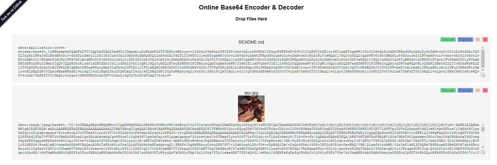

# Online Base64

The online living [Base64](https://www.wikidata.org/wiki/Q726780) Encoder & Decoder.

[1]: http://www.rfc-editor.org/rfc/rfc822.txt "RFC-822"
[2]: http://www.rfc-editor.org/rfc/rfc2045.txt "RFC-2045"
[3]: http://www.rfc-editor.org/rfc/rfc2046.txt "RFC-2046"
[4]: http://www.rfc-editor.org/rfc/rfc2047.txt "RFC-2047"
[5]: http://www.rfc-editor.org/rfc/rfc2048.txt "RFC-2048"
[6]: http://www.rfc-editor.org/rfc/rfc2049.txt "RFC-2049"

# About MIME

- [RFC-822][1] Standard for ARPA Internet text messages
- [RFC-2045][2] MIME Part 1: Format of Internet Message Bodies
- [RFC-2046][3] MIME Part 2: Media Types
- [RFC-2047][4] MIME Part 3: Header Extensions for Non-ASCII Text
- [RFC-2048][5] MIME Part 4: Registration Procedures
- [RFC-2049][6] MIME Part 5: Conformance Criteria and Examples

- `data:application/` ... `;base64,` ....
- `data:audio/`...`;base64,` ....
- `data:image/`...`;base64,` ....
- `data:message/`...`;base64,` ....
- `data:text/`...`;base64,` ....
- `data:video/`...`;base64,` ....